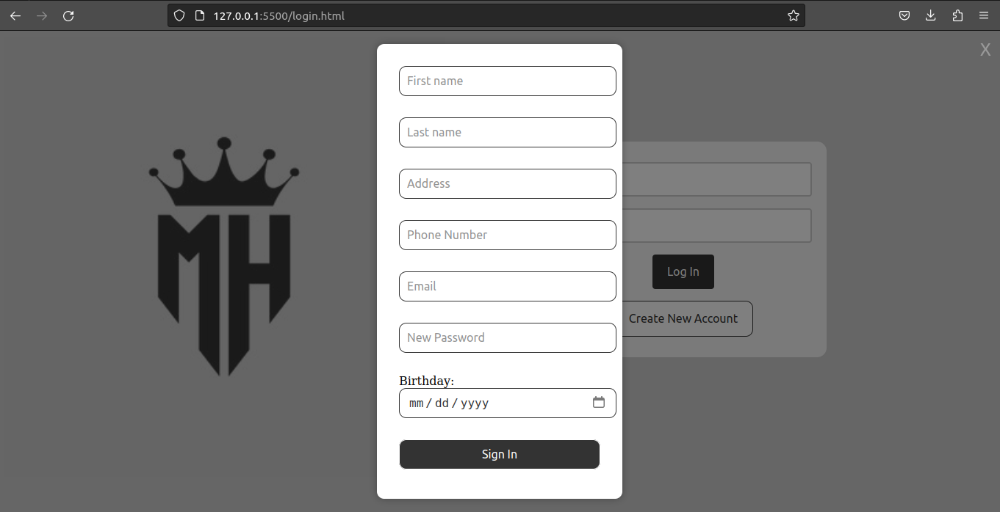

# Relatório do Projeto

### Requisitos
O sistema deve ter 2 tipos de usuários: Clientes e Administradores.
1. Os Administradores são responsáveis pelo registro/gerenciamento de administradores, clientes e produtos/serviços fornecidos. A aplicação já vem com uma conta admin com senha admin.
2. Os clientes são usuários que acessam o sistema para comprar produtos/serviços.
3. O registro do administrador inclui, no mínimo: nome, id, telefone, e-mail.
4. Cada registro de cliente inclui, no mínimo: nome, id, endereço, telefone, e-mail.
5. Os registros de produtos/serviços incluem, no mínimo: nome, id, foto, descrição, preço, quantidade (em estoque) e quantidade vendida.
6. Sua loja pode vender produtos, serviços ou ambos (você decide).
7. Venda de produtos (ou serviços): Os produtos são selecionados, a quantidade escolhida e são incluídos em um carrinho. Os produtos são comprados usando um número de cartão de crédito (qualquer número é aceito pelo sistema). A quantidade de produtos vendidos é subtraída ao montante de estoque e adicionada ao montante dos vendidos.
8. Gestão de Produtos/Serviços: Os administradores podem criar/atualizar/ler/excluir (crud) novos produtos e serviços. Por exemplo, eles podem alterar a quantidade em estoque.
9. Sua funcionalidade: Crie uma funcionalidade que seja específica para o seu aplicativo. Não precisa ser algo complicado. Por exemplo, se você está vendendo carros, pode permitir que os usuários usem um acelerador para ouvir como cada motor de carro ruge.
10. O sistema deve ser acessível e oferecer boa usabilidade. O sistema deve ser responsivo, o que significa que deve completar as tarefas atribuídas dentro de um tempo razoável.

### Descricao do Projeto

Conforme descrito em "Requisitos", dois tipos de usuários poderão fazer uso da aplicação WEB: clientes e administradores. Sendo assim, a forma com a qual o usuário interage com as telas será diferente de acordo com o tipo de usuário. Por exemplo, ao se acessar a tela "Produtos" (falaremos dela mais a frente) como cliente, será possível navegar pelos produtos, inspecionando-os e adicionando-os no carrinho caso desejado. Por outro lado, ao acessar a tela "Produtos" como administrador, outros recursos estarão disponíveis, como a alteração de catálogo, alteração de detalhes dos produtos, e assim por diante. A Figura a seguir resume nossa aplicação e as diferentes maneiras com as quais será possível interagir com as telas:

Seguindo a ideia geral do fluxograma, as telas "Home-Page", "Login/Signin", "Sobre Nos" e "Produtos" foram projetadas através de HTML5/CSS3:

* [Home-Page](index.html): tela inicial da nossa aplicação. Contém uma barra de navegação interativa capaz de realizar redirecionamentos para todas as telas existentes (exceto "Administrador" e "Estoque", as quais são exclusivas para administradores), uma seção Produtos, a qual apresenta as informações gerais dos tipos de produtos oferecidos pela loja, permitindo redirecionamento às partes específicas da tela "Produtos" correspondentes a cada tipo de produto, e uma seçao Marcas, contendo informações geriais sobre as marcas oferecidas pela nossa loja. A seguir, screenshot da situação atual da tela em questão:

* [Login/Signin](login.html): tela minimalista que contém o necessário para o usuário realizar a operação de login e signin na aplicação, sendo a única página, até o momento, que contém código JavaScript. Inicialmente, o usuário se depara com os campos necessários para o login (email e senha), um botão para realizar o login e outro para cadastrar um novo usuário, conforme a screenshot a seguir:

Ao se clicar no botão "Create New Account", uma nova tela surge "acima" da tela anterior, contendo os campos necessários para o signin (nome, email, endereço, telefone, data de nascimento e senha) e um botão de submissão, conforme a screenshot a seguir:

* [Sobre Nos](sobre-nos.html):

* [Produtos](produtos.html): 

O restante das telas necessárias para nossa aplicação, "Carrinho", "Administrador" e "Estoque" foram projetadas com a ferramenta Figma:

* Carrinho:

* Administrador:

* Estoque: 

### Comentarios Sobre o Código

* [Estilo das Telas](css): para facilitar o reuso de código, o arquivo [style.css](css/style.css) foi criado contendo o estilo dos elementos compartilhados, praticamente, por todas as telas da nossa aplicação, como o body, o header e o footer. Além disso, um ou mais arquivos ".css" adicionais foram empregados para a estilização específica das telas, complementando aquela trazida pelo arquivo "style.css". Como exemplo, a tela "Login/Signin" conta com os arquivos [login.css](css/login.css) e [signin.css](css/signin.css) para estilização completa da página.

### Plano de Testes

Ainda não temos um plano robusto para realização de testes da aplicação WEB. Entretanto, conforme aprendido nas primeiras aulas do curso, consideramos que a ferramenta [Insomnia](https://insomnia.rest) pode ser bastante útil para realização de testes referentes às comunicações HTTP estabelecidas entre cliente e servidor

### Resultado dos Testes
### Como rodar?
### Problemas Encontrados
### Comentarios
